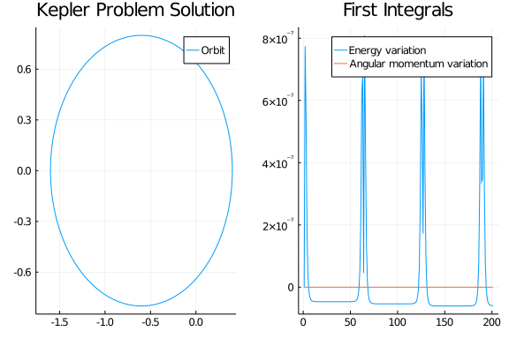
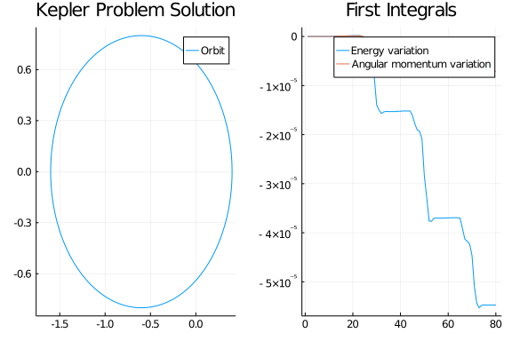
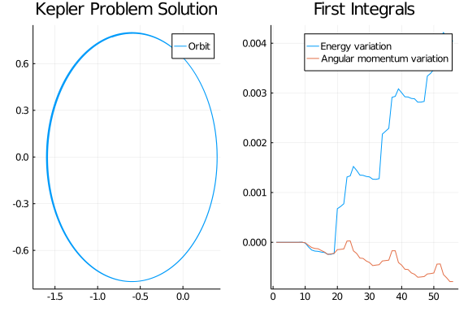
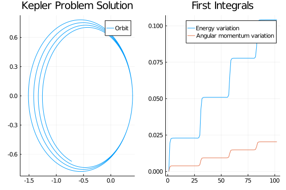
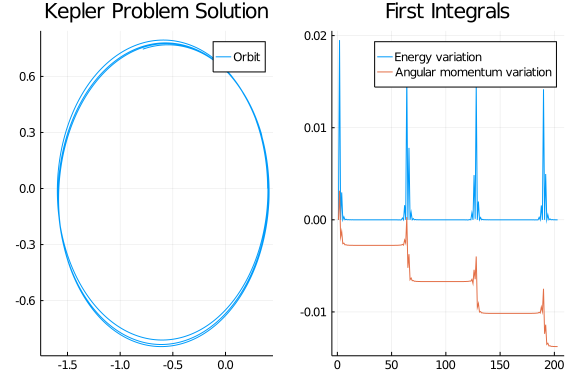

The Hamiltonian $\mathcal {H}$ and the angular momentum $L$ for the Kepler problem are

$$\mathcal {H} = \frac{1}{2}(\dot{q}^2_1+\dot{q}^2_2)-\frac{1}{\sqrt{q^2_1+q^2_2}},\quad
L = q_1\dot{q_2} - \dot{q_1}q_2$$

Also, we know that

$${\displaystyle {\frac {\mathrm {d} {\boldsymbol {p}}}{\mathrm {d} t}}=-{\frac {\partial {\mathcal {H}}}{\partial {\boldsymbol {q}}}}\quad ,\quad {\frac {\mathrm {d} {\boldsymbol {q}}}{\mathrm {d} t}}=+{\frac {\partial {\mathcal {H}}}{\partial {\boldsymbol {p}}}}}$$

```julia
using OrdinaryDiffEq, LinearAlgebra, ForwardDiff, Plots; gr()
H(q,p) = norm(p)^2/2 - inv(norm(q))
L(q,p) = q[1]*p[2] - p[1]*q[2]

pdot(dp,p,q,params,t) = ForwardDiff.gradient!(dp, q->-H(q, p), q)
qdot(dq,p,q,params,t) = ForwardDiff.gradient!(dq, p-> H(q, p), p)

initial_position = [.4, 0]
initial_velocity = [0., 2.]
initial_cond = (initial_position, initial_velocity)
initial_first_integrals = (H(initial_cond...), L(initial_cond...))
tspan = (0,20.)
prob = DynamicalODEProblem(pdot, qdot, initial_velocity, initial_position, tspan)
sol = solve(prob, KahanLi6(), dt=1//10);
```


Let's plot the orbit and check the energy and angular momentum variation. We know that energy and angular momentum should be constant, and they are also called first integrals.

```julia
plot_orbit(sol) = plot(sol,vars=(3,4), lab="Orbit", title="Kepler Problem Solution")

function plot_first_integrals(sol, H, L)
    plot(initial_first_integrals[1].-map(u->H(u[2,:], u[1,:]), sol.u), lab="Energy variation", title="First Integrals")
    plot!(initial_first_integrals[2].-map(u->L(u[2,:], u[1,:]), sol.u), lab="Angular momentum variation")
end
analysis_plot(sol, H, L) = plot(plot_orbit(sol), plot_first_integrals(sol, H, L))
```

```
analysis_plot (generic function with 1 method)
```


```julia
analysis_plot(sol, H, L)
```




Let's try to use a Runge-Kutta-Nyström solver to solve this problem and check the first integrals' variation.

```julia
sol2 = solve(prob, DPRKN6())  # dt is not necessary, because unlike symplectic
                              # integrators DPRKN6 is adaptive
@show sol2.u |> length
analysis_plot(sol2, H, L)
```

```
sol2.u |> length = 91
```





Let's then try to solve the same problem by the `ERKN4` solver, which is specialized for sinusoid-like periodic function

```julia
sol3 = solve(prob, ERKN4()) # dt is not necessary, because unlike symplectic
                            # integrators ERKN4 is adaptive
@show sol3.u |> length
analysis_plot(sol3, H, L)
```

```
sol3.u |> length = 55
```


We can see that `ERKN4` does a bad job for this problem, because this problem is not sinusoid-like.

One advantage of using `DynamicalODEProblem` is that it can implicitly convert the second order ODE problem to a *normal* system of first order ODEs, which is solvable for other ODE solvers. Let's use the `Tsit5` solver for the next example.

```julia
sol4 = solve(prob, Tsit5())
@show sol4.u |> length
analysis_plot(sol4, H, L)
```

```
sol4.u |> length = 57
```





#### Note

There is drifting for all the solutions, and high order methods are drifting less because they are more accurate.

### Conclusion

---

Symplectic integrator does not conserve the energy completely at all time, but the energy can come back. In order to make sure that the energy fluctuation comes back eventually, symplectic integrator has to have a fixed time step. Despite the energy variation, symplectic integrator conserves the angular momentum perfectly.

Both Runge-Kutta-Nyström and Runge-Kutta integrator do not conserve energy nor the angular momentum, and the first integrals do not tend to come back. An advantage Runge-Kutta-Nyström integrator over symplectic integrator is that RKN integrator can have adaptivity. An advantage Runge-Kutta-Nyström integrator over Runge-Kutta integrator is that RKN integrator has less function evaluation per step. The `ERKN4` solver works best for sinusoid-like solutions.

## Manifold Projection

In this example, we know that energy and angular momentum should be conserved. We can achieve this through mainfold projection. As the name implies, it is a procedure to project the ODE solution to a manifold. Let's start with a base case, where mainfold projection isn't being used.

```julia
using DiffEqCallbacks

plot_orbit2(sol) = plot(sol,vars=(1,2), lab="Orbit", title="Kepler Problem Solution")

function plot_first_integrals2(sol, H, L)
    plot(initial_first_integrals[1].-map(u->H(u[1:2],u[3:4]), sol.u), lab="Energy variation", title="First Integrals")
    plot!(initial_first_integrals[2].-map(u->L(u[1:2],u[3:4]), sol.u), lab="Angular momentum variation")
end

analysis_plot2(sol, H, L) = plot(plot_orbit2(sol), plot_first_integrals2(sol, H, L))

function hamiltonian(du,u,params,t)
    q, p = u[1:2], u[3:4]
    qdot(@view(du[1:2]), p, q, params, t)
    pdot(@view(du[3:4]), p, q, params, t)
end

prob2 = ODEProblem(hamiltonian, [initial_position; initial_velocity], tspan)
sol_ = solve(prob2, RK4(), dt=1//5, adaptive=false)
analysis_plot2(sol_, H, L)
```




There is a significant fluctuation in the first integrals, when there is no mainfold projection.

```julia
function first_integrals_manifold(residual,u)
    residual[1:2] .= initial_first_integrals[1] - H(u[1:2], u[3:4])
    residual[3:4] .= initial_first_integrals[2] - L(u[1:2], u[3:4])
end

cb = ManifoldProjection(first_integrals_manifold)
sol5 = solve(prob2, RK4(), dt=1//5, adaptive=false, callback=cb)
analysis_plot2(sol5, H, L)
```


We can see that thanks to the manifold projection, the first integrals' variation is very small, although we are using `RK4` which is not symplectic. But wait, what if we only project to the energy conservation manifold?

```julia
function energy_manifold(residual,u)
    residual[1:2] .= initial_first_integrals[1] - H(u[1:2], u[3:4])
    residual[3:4] .= 0
end
energy_cb = ManifoldProjection(energy_manifold)
sol6 = solve(prob2, RK4(), dt=1//5, adaptive=false, callback=energy_cb)
analysis_plot2(sol6, H, L)
```




There is almost no energy variation but angular momentum varies quite bit. How about only project to the angular momentum conservation manifold?

```julia
function angular_manifold(residual,u)
    residual[1:2] .= initial_first_integrals[2] - L(u[1:2], u[3:4])
    residual[3:4] .= 0
end
angular_cb = ManifoldProjection(angular_manifold)
sol7 = solve(prob2, RK4(), dt=1//5, adaptive=false, callback=angular_cb)
analysis_plot2(sol7, H, L)
```


Again, we see what we expect.


## Appendix

These tutorials are a part of the SciMLTutorials.jl repository, found at: [https://github.com/SciML/SciMLTutorials.jl](https://github.com/SciML/SciMLTutorials.jl). For more information on high-performance scientific machine learning, check out the SciML Open Source Software Organization [https://sciml.ai](https://sciml.ai).

To locally run this tutorial, do the following commands:

```
using SciMLTutorials
SciMLTutorials.weave_file("tutorials/models","05-kepler_problem.jmd")
```

Computer Information:

```
Julia Version 1.6.2
Commit 1b93d53fc4 (2021-07-14 15:36 UTC)
Platform Info:
  OS: Linux (x86_64-pc-linux-gnu)
  CPU: AMD EPYC 7502 32-Core Processor
  WORD_SIZE: 64
  LIBM: libopenlibm
  LLVM: libLLVM-11.0.1 (ORCJIT, znver2)
Environment:
  JULIA_DEPOT_PATH = /root/.cache/julia-buildkite-plugin/depots/a6029d3a-f78b-41ea-bc97-28aa57c6c6ea
  JULIA_NUM_THREADS = 16

```

Package Information:

```
      Status `/var/lib/buildkite-agent/builds/7-amdci4-julia-csail-mit-edu/julialang/scimltutorials-dot-jl/tutorials/models/Project.toml`
  [479239e8] Catalyst v6.12.1
  [459566f4] DiffEqCallbacks v2.16.1
  [f3b72e0c] DiffEqDevTools v2.27.2
  [055956cb] DiffEqPhysics v3.9.0
  [0c46a032] DifferentialEquations v6.17.1
  [31c24e10] Distributions v0.24.18
  [587475ba] Flux v0.12.1
  [f6369f11] ForwardDiff v0.10.18
  [23fbe1c1] Latexify v0.15.5
  [961ee093] ModelingToolkit v5.17.3
  [2774e3e8] NLsolve v4.5.1
  [315f7962] NeuralPDE v3.10.1
  [429524aa] Optim v1.3.0
  [1dea7af3] OrdinaryDiffEq v5.56.0
  [91a5bcdd] Plots v1.15.2
  [731186ca] RecursiveArrayTools v2.11.4
  [30cb0354] SciMLTutorials v0.9.0
  [789caeaf] StochasticDiffEq v6.34.1
  [37e2e46d] LinearAlgebra
  [2f01184e] SparseArrays
```

And the full manifest:

```
      Status `/var/lib/buildkite-agent/builds/7-amdci4-julia-csail-mit-edu/julialang/scimltutorials-dot-jl/tutorials/models/Manifest.toml`
  [c3fe647b] AbstractAlgebra v0.16.0
  [621f4979] AbstractFFTs v1.0.1
  [1520ce14] AbstractTrees v0.3.4
  [79e6a3ab] Adapt v3.3.0
  [ec485272] ArnoldiMethod v0.1.0
  [4fba245c] ArrayInterface v3.1.15
  [4c555306] ArrayLayouts v0.7.0
  [13072b0f] AxisAlgorithms v1.0.0
  [ab4f0b2a] BFloat16s v0.1.0
  [aae01518] BandedMatrices v0.16.9
  [764a87c0] BoundaryValueDiffEq v2.7.1
  [fa961155] CEnum v0.4.1
  [00ebfdb7] CSTParser v2.5.0
  [052768ef] CUDA v2.6.3
  [479239e8] Catalyst v6.12.1
  [082447d4] ChainRules v0.7.65
  [d360d2e6] ChainRulesCore v0.9.44
  [b630d9fa] CheapThreads v0.2.5
  [944b1d66] CodecZlib v0.7.0
  [35d6a980] ColorSchemes v3.12.1
  [3da002f7] ColorTypes v0.11.0
  [5ae59095] Colors v0.12.8
  [861a8166] Combinatorics v1.0.2
  [a80b9123] CommonMark v0.8.1
  [38540f10] CommonSolve v0.2.0
  [bbf7d656] CommonSubexpressions v0.3.0
  [34da2185] Compat v3.30.0
  [8f4d0f93] Conda v1.5.2
  [88cd18e8] ConsoleProgressMonitor v0.1.2
  [187b0558] ConstructionBase v1.2.1
  [d38c429a] Contour v0.5.7
  [a8cc5b0e] Crayons v4.0.4
  [8a292aeb] Cuba v2.2.0
  [667455a9] Cubature v1.5.1
  [9a962f9c] DataAPI v1.6.0
  [82cc6244] DataInterpolations v3.3.1
  [864edb3b] DataStructures v0.18.9
  [e2d170a0] DataValueInterfaces v1.0.0
  [bcd4f6db] DelayDiffEq v5.31.0
  [2b5f629d] DiffEqBase v6.62.2
  [459566f4] DiffEqCallbacks v2.16.1
  [f3b72e0c] DiffEqDevTools v2.27.2
  [5a0ffddc] DiffEqFinancial v2.4.0
  [aae7a2af] DiffEqFlux v1.37.0
  [c894b116] DiffEqJump v6.14.2
  [77a26b50] DiffEqNoiseProcess v5.7.3
  [055956cb] DiffEqPhysics v3.9.0
  [41bf760c] DiffEqSensitivity v6.45.0
  [163ba53b] DiffResults v1.0.3
  [b552c78f] DiffRules v1.0.2
  [0c46a032] DifferentialEquations v6.17.1
  [c619ae07] DimensionalPlotRecipes v1.2.0
  [b4f34e82] Distances v0.10.3
  [31c24e10] Distributions v0.24.18
  [ced4e74d] DistributionsAD v0.6.26
  [ffbed154] DocStringExtensions v0.8.4
  [e30172f5] Documenter v0.26.3
  [d4d017d3] ExponentialUtilities v1.8.4
  [e2ba6199] ExprTools v0.1.3
  [c87230d0] FFMPEG v0.4.0
  [7a1cc6ca] FFTW v1.4.1
  [7034ab61] FastBroadcast v0.1.8
  [9aa1b823] FastClosures v0.3.2
  [1a297f60] FillArrays v0.11.7
  [6a86dc24] FiniteDiff v2.8.0
  [53c48c17] FixedPointNumbers v0.8.4
  [587475ba] Flux v0.12.1
  [59287772] Formatting v0.4.2
  [f6369f11] ForwardDiff v0.10.18
  [069b7b12] FunctionWrappers v1.1.2
  [d9f16b24] Functors v0.2.1
  [0c68f7d7] GPUArrays v6.4.1
  [61eb1bfa] GPUCompiler v0.10.0
  [28b8d3ca] GR v0.57.4
  [a75be94c] GalacticOptim v1.2.0
  [5c1252a2] GeometryBasics v0.3.12
  [af5da776] GlobalSensitivity v1.0.0
  [42e2da0e] Grisu v1.0.2
  [19dc6840] HCubature v1.5.0
  [cd3eb016] HTTP v0.9.9
  [eafb193a] Highlights v0.4.5
  [0e44f5e4] Hwloc v2.0.0
  [7073ff75] IJulia v1.23.2
  [b5f81e59] IOCapture v0.1.1
  [7869d1d1] IRTools v0.4.2
  [615f187c] IfElse v0.1.0
  [d25df0c9] Inflate v0.1.2
  [83e8ac13] IniFile v0.5.0
  [a98d9a8b] Interpolations v0.13.2
  [c8e1da08] IterTools v1.3.0
  [42fd0dbc] IterativeSolvers v0.9.1
  [82899510] IteratorInterfaceExtensions v1.0.0
  [692b3bcd] JLLWrappers v1.3.0
  [682c06a0] JSON v0.21.1
  [98e50ef6] JuliaFormatter v0.13.7
  [e5e0dc1b] Juno v0.8.4
  [5ab0869b] KernelDensity v0.6.3
  [929cbde3] LLVM v3.7.1
  [b964fa9f] LaTeXStrings v1.2.1
  [2ee39098] LabelledArrays v1.6.1
  [23fbe1c1] Latexify v0.15.5
  [a5e1c1ea] LatinHypercubeSampling v1.8.0
  [73f95e8e] LatticeRules v0.0.1
  [1d6d02ad] LeftChildRightSiblingTrees v0.1.2
  [093fc24a] LightGraphs v1.3.5
  [d3d80556] LineSearches v7.1.1
  [2ab3a3ac] LogExpFunctions v0.2.4
  [e6f89c97] LoggingExtras v0.4.6
  [bdcacae8] LoopVectorization v0.12.23
  [1914dd2f] MacroTools v0.5.6
  [739be429] MbedTLS v1.0.3
  [442fdcdd] Measures v0.3.1
  [e89f7d12] Media v0.5.0
  [c03570c3] Memoize v0.4.4
  [e1d29d7a] Missings v1.0.0
  [961ee093] ModelingToolkit v5.17.3
  [4886b29c] MonteCarloIntegration v0.0.2
  [46d2c3a1] MuladdMacro v0.2.2
  [f9640e96] MultiScaleArrays v1.8.1
  [ffc61752] Mustache v1.0.10
  [d41bc354] NLSolversBase v7.8.0
  [2774e3e8] NLsolve v4.5.1
  [872c559c] NNlib v0.7.19
  [77ba4419] NaNMath v0.3.5
  [315f7962] NeuralPDE v3.10.1
  [8913a72c] NonlinearSolve v0.3.8
  [6fe1bfb0] OffsetArrays v1.9.0
  [429524aa] Optim v1.3.0
  [bac558e1] OrderedCollections v1.4.1
  [1dea7af3] OrdinaryDiffEq v5.56.0
  [90014a1f] PDMats v0.11.0
  [65888b18] ParameterizedFunctions v5.10.0
  [d96e819e] Parameters v0.12.2
  [69de0a69] Parsers v1.1.0
  [ccf2f8ad] PlotThemes v2.0.1
  [995b91a9] PlotUtils v1.0.10
  [91a5bcdd] Plots v1.15.2
  [e409e4f3] PoissonRandom v0.4.0
  [f517fe37] Polyester v0.3.1
  [85a6dd25] PositiveFactorizations v0.2.4
  [21216c6a] Preferences v1.2.2
  [33c8b6b6] ProgressLogging v0.1.4
  [92933f4c] ProgressMeter v1.6.2
  [1fd47b50] QuadGK v2.4.1
  [67601950] Quadrature v1.8.1
  [8a4e6c94] QuasiMonteCarlo v0.2.2
  [74087812] Random123 v1.3.1
  [fb686558] RandomExtensions v0.4.3
  [e6cf234a] RandomNumbers v1.4.0
  [c84ed2f1] Ratios v0.4.0
  [3cdcf5f2] RecipesBase v1.1.1
  [01d81517] RecipesPipeline v0.3.2
  [731186ca] RecursiveArrayTools v2.11.4
  [f2c3362d] RecursiveFactorization v0.1.12
  [189a3867] Reexport v1.0.0
  [ae029012] Requires v1.1.3
  [ae5879a3] ResettableStacks v1.1.0
  [37e2e3b7] ReverseDiff v1.9.0
  [79098fc4] Rmath v0.7.0
  [47965b36] RootedTrees v1.0.0
  [7e49a35a] RuntimeGeneratedFunctions v0.5.2
  [476501e8] SLEEFPirates v0.6.20
  [1bc83da4] SafeTestsets v0.0.1
  [0bca4576] SciMLBase v1.13.4
  [30cb0354] SciMLTutorials v0.9.0
  [6c6a2e73] Scratch v1.0.3
  [efcf1570] Setfield v0.7.0
  [992d4aef] Showoff v1.0.3
  [699a6c99] SimpleTraits v0.9.3
  [ed01d8cd] Sobol v1.5.0
  [b85f4697] SoftGlobalScope v1.1.0
  [a2af1166] SortingAlgorithms v1.0.0
  [47a9eef4] SparseDiffTools v1.13.2
  [276daf66] SpecialFunctions v1.4.1
  [860ef19b] StableRNGs v1.0.0
  [aedffcd0] Static v0.2.4
  [90137ffa] StaticArrays v1.2.0
  [82ae8749] StatsAPI v1.0.0
  [2913bbd2] StatsBase v0.33.8
  [4c63d2b9] StatsFuns v0.9.8
  [9672c7b4] SteadyStateDiffEq v1.6.2
  [789caeaf] StochasticDiffEq v6.34.1
  [7792a7ef] StrideArraysCore v0.1.11
  [09ab397b] StructArrays v0.5.1
  [c3572dad] Sundials v4.4.3
  [d1185830] SymbolicUtils v0.11.2
  [0c5d862f] Symbolics v0.1.25
  [3783bdb8] TableTraits v1.0.1
  [bd369af6] Tables v1.4.2
  [5d786b92] TerminalLoggers v0.1.3
  [8290d209] ThreadingUtilities v0.4.4
  [a759f4b9] TimerOutputs v0.5.9
  [0796e94c] Tokenize v0.5.16
  [9f7883ad] Tracker v0.2.16
  [3bb67fe8] TranscodingStreams v0.9.5
  [592b5752] Trapz v2.0.2
  [a2a6695c] TreeViews v0.3.0
  [5c2747f8] URIs v1.3.0
  [3a884ed6] UnPack v1.0.2
  [1986cc42] Unitful v1.7.0
  [3d5dd08c] VectorizationBase v0.20.11
  [81def892] VersionParsing v1.2.0
  [19fa3120] VertexSafeGraphs v0.1.2
  [44d3d7a6] Weave v0.10.8
  [efce3f68] WoodburyMatrices v0.5.3
  [ddb6d928] YAML v0.4.6
  [c2297ded] ZMQ v1.2.1
  [a5390f91] ZipFile v0.9.3
  [e88e6eb3] Zygote v0.6.11
  [700de1a5] ZygoteRules v0.2.1
  [6e34b625] Bzip2_jll v1.0.6+5
  [83423d85] Cairo_jll v1.16.0+6
  [3bed1096] Cuba_jll v4.2.1+0
  [7bc98958] Cubature_jll v1.0.4+0
  [5ae413db] EarCut_jll v2.1.5+1
  [2e619515] Expat_jll v2.2.10+0
  [b22a6f82] FFMPEG_jll v4.3.1+4
  [f5851436] FFTW_jll v3.3.9+7
  [a3f928ae] Fontconfig_jll v2.13.1+14
  [d7e528f0] FreeType2_jll v2.10.1+5
  [559328eb] FriBidi_jll v1.0.5+6
  [0656b61e] GLFW_jll v3.3.4+0
  [d2c73de3] GR_jll v0.57.2+0
  [78b55507] Gettext_jll v0.21.0+0
  [7746bdde] Glib_jll v2.68.1+0
  [e33a78d0] Hwloc_jll v2.4.1+0
  [1d5cc7b8] IntelOpenMP_jll v2018.0.3+2
  [aacddb02] JpegTurbo_jll v2.0.1+3
  [c1c5ebd0] LAME_jll v3.100.0+3
  [dd4b983a] LZO_jll v2.10.1+0
  [dd192d2f] LibVPX_jll v1.9.0+1
  [e9f186c6] Libffi_jll v3.2.2+0
  [d4300ac3] Libgcrypt_jll v1.8.7+0
  [7e76a0d4] Libglvnd_jll v1.3.0+3
  [7add5ba3] Libgpg_error_jll v1.42.0+0
  [94ce4f54] Libiconv_jll v1.16.1+0
  [4b2f31a3] Libmount_jll v2.35.0+0
  [89763e89] Libtiff_jll v4.1.0+2
  [38a345b3] Libuuid_jll v2.36.0+0
  [856f044c] MKL_jll v2021.1.1+1
  [e7412a2a] Ogg_jll v1.3.4+2
  [458c3c95] OpenSSL_jll v1.1.1+6
  [efe28fd5] OpenSpecFun_jll v0.5.4+0
  [91d4177d] Opus_jll v1.3.1+3
  [2f80f16e] PCRE_jll v8.44.0+0
  [30392449] Pixman_jll v0.40.1+0
  [ea2cea3b] Qt5Base_jll v5.15.2+0
  [f50d1b31] Rmath_jll v0.3.0+0
  [fb77eaff] Sundials_jll v5.2.0+1
  [a2964d1f] Wayland_jll v1.17.0+4
  [2381bf8a] Wayland_protocols_jll v1.18.0+4
  [02c8fc9c] XML2_jll v2.9.12+0
  [aed1982a] XSLT_jll v1.1.34+0
  [4f6342f7] Xorg_libX11_jll v1.6.9+4
  [0c0b7dd1] Xorg_libXau_jll v1.0.9+4
  [935fb764] Xorg_libXcursor_jll v1.2.0+4
  [a3789734] Xorg_libXdmcp_jll v1.1.3+4
  [1082639a] Xorg_libXext_jll v1.3.4+4
  [d091e8ba] Xorg_libXfixes_jll v5.0.3+4
  [a51aa0fd] Xorg_libXi_jll v1.7.10+4
  [d1454406] Xorg_libXinerama_jll v1.1.4+4
  [ec84b674] Xorg_libXrandr_jll v1.5.2+4
  [ea2f1a96] Xorg_libXrender_jll v0.9.10+4
  [14d82f49] Xorg_libpthread_stubs_jll v0.1.0+3
  [c7cfdc94] Xorg_libxcb_jll v1.13.0+3
  [cc61e674] Xorg_libxkbfile_jll v1.1.0+4
  [12413925] Xorg_xcb_util_image_jll v0.4.0+1
  [2def613f] Xorg_xcb_util_jll v0.4.0+1
  [975044d2] Xorg_xcb_util_keysyms_jll v0.4.0+1
  [0d47668e] Xorg_xcb_util_renderutil_jll v0.3.9+1
  [c22f9ab0] Xorg_xcb_util_wm_jll v0.4.1+1
  [35661453] Xorg_xkbcomp_jll v1.4.2+4
  [33bec58e] Xorg_xkeyboard_config_jll v2.27.0+4
  [c5fb5394] Xorg_xtrans_jll v1.4.0+3
  [8f1865be] ZeroMQ_jll v4.3.2+6
  [3161d3a3] Zstd_jll v1.5.0+0
  [0ac62f75] libass_jll v0.14.0+4
  [f638f0a6] libfdk_aac_jll v0.1.6+4
  [b53b4c65] libpng_jll v1.6.38+0
  [a9144af2] libsodium_jll v1.0.20+0
  [f27f6e37] libvorbis_jll v1.3.6+6
  [1270edf5] x264_jll v2020.7.14+2
  [dfaa095f] x265_jll v3.0.0+3
  [d8fb68d0] xkbcommon_jll v0.9.1+5
  [0dad84c5] ArgTools
  [56f22d72] Artifacts
  [2a0f44e3] Base64
  [ade2ca70] Dates
  [8bb1440f] DelimitedFiles
  [8ba89e20] Distributed
  [f43a241f] Downloads
  [7b1f6079] FileWatching
  [9fa8497b] Future
  [b77e0a4c] InteractiveUtils
  [4af54fe1] LazyArtifacts
  [b27032c2] LibCURL
  [76f85450] LibGit2
  [8f399da3] Libdl
  [37e2e46d] LinearAlgebra
  [56ddb016] Logging
  [d6f4376e] Markdown
  [a63ad114] Mmap
  [ca575930] NetworkOptions
  [44cfe95a] Pkg
  [de0858da] Printf
  [9abbd945] Profile
  [3fa0cd96] REPL
  [9a3f8284] Random
  [ea8e919c] SHA
  [9e88b42a] Serialization
  [1a1011a3] SharedArrays
  [6462fe0b] Sockets
  [2f01184e] SparseArrays
  [10745b16] Statistics
  [4607b0f0] SuiteSparse
  [fa267f1f] TOML
  [a4e569a6] Tar
  [8dfed614] Test
  [cf7118a7] UUIDs
  [4ec0a83e] Unicode
  [e66e0078] CompilerSupportLibraries_jll
  [deac9b47] LibCURL_jll
  [29816b5a] LibSSH2_jll
  [c8ffd9c3] MbedTLS_jll
  [14a3606d] MozillaCACerts_jll
  [4536629a] OpenBLAS_jll
  [bea87d4a] SuiteSparse_jll
  [83775a58] Zlib_jll
  [8e850ede] nghttp2_jll
  [3f19e933] p7zip_jll
```

